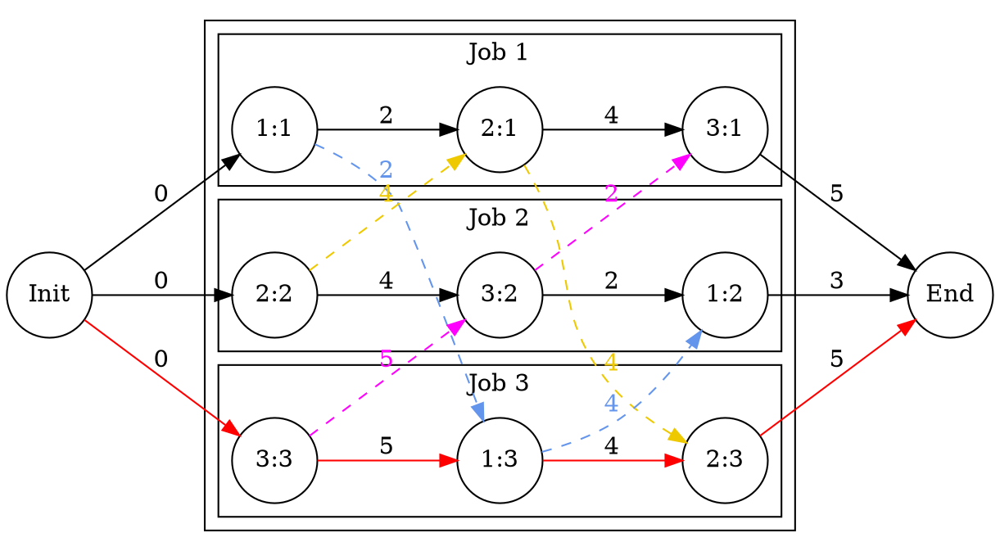

# Job-Shop Scheduling Problem

## 1. Description

In the classical Job-Shop problem there are _n_ jobs that must be processed on _m_ machines. Each job consists of a sequence of different tasks _(operations)_. Each task needs to be processed during an _uninterrupted_ period of time on a given machine.

Given a set _J_ of jobs, a set _M_ of machines and a set _T_ of tasks, we denote by _τ<sub>j</sub>_ the number of tasks for a given job _j_ ∈ _J_. To each task _a<sub>ij</sub>_ corresponds an ordered pair _(m<sub>ij</sub>, p<sub>ij</sub>)_: the task _a<sub>ij</sub>_ needs to be processed on machine _m<sub>ij</sub>_ ∈ _M_ for a period of _p<sub>ij</sub>_ units of time.

## 2. How to use it

This approach looks for a simple and unoptimized solution (schedule) to the well-known Singer & Pinedo benchmark-set.

config.properties contains the path to the benchmark-set.

```properties
#JobShop Properties
#Wed Sep 04 08:10:22 COT 2019
path=benchmark-set
```

path (either relative or absolute) where the .txt files are stored.

Scheduling and exporting to dot format:

```java
package com.github.guillesup.example;

import com.github.guillesup.interactors.BenchmarkReport;
import com.github.guillesup.interactors.JobShop;

public class Example {
    public static void main(String[] args) {
        var scheduledBenchmark = JobShop.schedule("b101");
        System.out.println(BenchmarkReport.getInstance(scheduledBenchmark).toDot());
        
        // Also you can save it.
        BenchmarkReport.getInstance(scheduledBenchmark).saveDotToDisk();
    }
}
```

dot format:


Scheduling and reporting to the console:

```java
package com.github.guillesup.example;

import com.github.guillesup.interactors.BenchmarkReport;
import com.github.guillesup.interactors.JobShop;

public class Example {
    public static void main(String[] args) {
        var scheduledBenchmark = JobShop.schedule("b101");
        System.out.println(BenchmarkReport.getInstance(scheduledBenchmark).getReport());
    }
}
```

benchmark report:

```console
------------------------------------
Benchmark
------------------------------------
	Id: b101.txt
      Jobs: 3
  Machines: 3
     Tasks: 9
Is acyclic: Yes

------------------------------------
Critical Path
------------------------------------
Weight: 14
Length: 4
  Path: [Init, 3:3, 1:3, 2:3, End]

+------------+----------+----------+ 
| Task (m:j) | End time | Due date |
+------------+----------+----------+ 
|        3:1 | 13       | 10       |
|        1:2 | 12       | 11       |
|        2:3 | 14       | 16       |
+------------+----------+----------+  
```

b101.dot to PNG

![alt text][b101.png]

[b101.png]: b101.png "b101.png"
